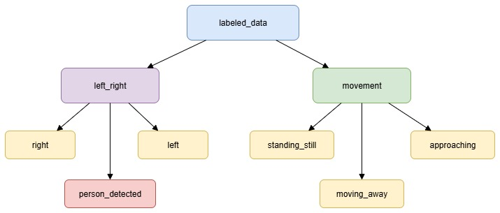

# Automated-Labeling-of-Ultrasonic-Sensor-Data-for-Pedestrian-Detection-in-Cars

## Contents

*   [What is this?](#what-is-this)
    *   [GUI](#gui)
    *   [Enviromenet](#enviroment)
    *   [Folder Structure](#folder-structure)
*  [Conclusion](#conclusion)
*  [Sources](#sources)

## What is this?
Traditionally, pedestrian detection relies heavily on vision-based systems such as cameras and LiDAR. However, each modality presents limitations: cameras are sensitive to lighting conditions, and LiDAR is often expensive and power-intensive. In contrast, ultrasonic sensors provide a cost-effective, low-power, and weather-resilient alternative for proximity measurement.

Building on the ongoing research led by Frankfurt UAS professors Prof. Dr. Andreas Pech and Prof. Dr. Peter Nauth ([Paper](https://fra-uas.hessenfis.de/converis/portal/detail/Publication/11016456?lang=en_US)), this project provides a tool to automate the labeling of ultrasonic sensor data in support of their pedestrian detection work. The objective is to create structured, labeled datasets without requiring manual annotation—a process that is often time-consuming and inconsistent.

The system detects pedestrian events such as entry, exit, and directional movement using semantic segmentation on live video streams and aligns these events with time-stamped ultrasonic measurements. This automated labeling pipeline enables efficient creation of high-quality datasets, supporting further research and development of robust, affordable pedestrian detection systems based on ultrasonic signal analysis.

## GUI

