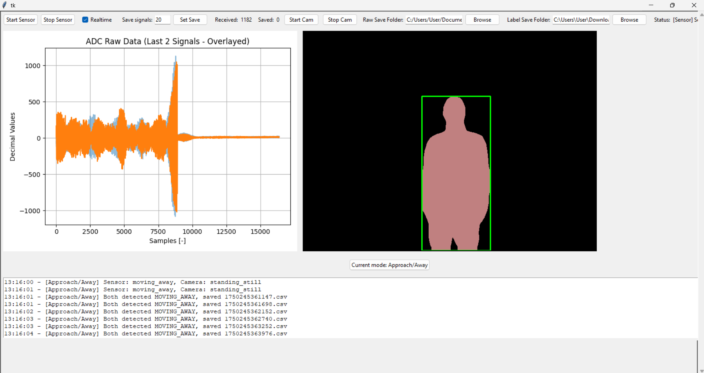
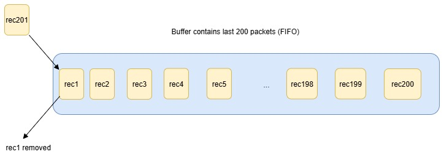

# Automated Labeling of Ultrasonic Sensor Data for Pedestrian Detection in Cars

## Contents

*   [What is this?](#what-is-this)
    *   [GUI](#gui)
    *   [Physical Setup](#physical-setup)
    *   [Directory Structure](#directory-structure)
*  [System Overview](#system-overview)
    *   [Data Acquisition Workflow](#data-acquisition-workflow)
    *   [Data Packet Structure](#data-packet-structure)
    *   [Data Buffer Management](#data-buffer-management)
    *   [Data Record Structure](#data-record-structure)
*  [Note](#note)
## What is this?
Traditionally, pedestrian detection relies heavily on vision-based systems such as cameras and LiDAR. However, each modality presents limitations: cameras are sensitive to lighting conditions, and LiDAR is often expensive and power-intensive. In contrast, ultrasonic sensors provide a cost-effective, low-power, and weather-resilient alternative for proximity measurement.

Building on the ongoing research led by Frankfurt UAS professors Prof. Dr. Andreas Pech and Prof. Dr. Peter Nauth ([Paper](https://fra-uas.hessenfis.de/converis/portal/detail/Publication/11016456?lang=en_US)), this project provides a tool to automate the labeling of ultrasonic sensor data in support of their pedestrian detection work. The objective is to create structured, labeled datasets without requiring manual annotation—a process that is often time-consuming and inconsistent.

The system detects pedestrian events such as entry, exit, and directional movement using semantic segmentation on live video streams and aligns these events with time-stamped ultrasonic measurements. This automated labeling pipeline enables efficient creation of high-quality datasets, supporting further research and development of robust, affordable pedestrian detection systems based on ultrasonic signal analysis.

### GUI
The GUI is built using Tkinter with two live views:
 * Left: Matplotlib plot updated every 200 ms with fading overlays of past signals from the Red Pitaya ultrasonic sensor. 
 * Right: real-time video with bounding box overlays and entry/exit annotations.

The GUI includes:
 * A mode toggle button to switch between Left/Right, as shown in the figure below

   
   
 * And Approach/Away labeling logic, as shown in the figure below

   

### Physical Setup
The figure shows the physical setup of the Red Pitaya and the camera mounted in front of the vehicle during the experiments. 

### Directory Structure

The `labeled_data` directory contains all automatically labeled ultrasonic sensor data, organized by the type of pedestrian detection event:

- **left_right/**:  
  Data is organized by the detected direction of pedestrian entry or exit, based on video tracking.
  - **entry_left_exit_left/**: Ultrasonic data captured when a person is entering left and exiting from the left side.
  - **entry_left_exit_right/**: Ultrasonic data captured when a person is entering left and exiting from the left right.
  - **entry_right_exit_right/**: Ultrasonic data captured when a person is entering from the right and exiting from the right side.
  - **entry_right_exit_left/**: Ultrasonic data captured when a person is entering from the right and exiting from the left side.

- **movement/**:  
  Data labeled according to pedestrian movement relative to the sensor.
  - **standing_still/**: Pedestrian detected standing still.
  - **approaching/**: Pedestrian approaching the sensor.
  - **moving_away/**: Pedestrian moving away from the sensor.

Each subfolder contains time-stamped CSV files representing individual sensor events. This structured format supports efficient dataset creation for further analysis and machine learning tasks.

## System Overview

The following diagrams illustrate the data acquisition and buffering process used for ultrasonic sensor labeling:

### Data Acquisition Workflow

The system starts with a control laptop that initiates a UDP client to communicate with the Red Pitaya sensor device (Host IP: 192.168.128.1, Port: 61231, SSH Port: 22). The UDP client sends commands and receives streamed data packets from the sensor for further processing.

---

### Data Packet Structure

Each data packet received from the sensor is 32,832 bytes, consisting of:
- **Header**: 64 bytes (16 × 4 bytes) for metadata and configuration.
- **ADC data**: 32,768 bytes (16,384 values, 2 bytes/value) representing raw ultrasonic measurements.

---

### Data Buffer Management

The system maintains a buffer that stores the most recent 200 data packets (First-In-First-Out). When a new packet (`rec201`) arrives, the oldest packet (`rec1`) is removed, ensuring the buffer only contains the latest sensor data.

---

### Data Record Structure

Each buffered packet is stored as a dictionary with:
- `'timestamp'`: The time the data was received
- `'data'`: The ADC data from the sensor

---

These mechanisms ensure efficient, real-time acquisition and organization of ultrasonic sensor data, enabling accurate labeling and further analysis.

For more details on the implementation, see [`main.py`](main.py).

## Note
**This project was developed as a group collaboration with [Kejdjon Cela](https://github.com/Kejdjon).**
